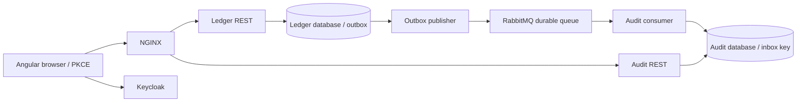

# Architecture decisions

## Boundaries

The ledger service owns accounts, balances, movements and delivery intent. The audit service owns its event log. Each service has a separate PostgreSQL database and migrations. Neither queries another service's tables. Keycloak owns identity and authentication.

## ADR 001 — Decimal ledger and immutability

Accepted. Monetary operations use BigDecimal at the boundary and numeric(16,2) in PostgreSQL. Rounding is rejected instead of silently changing the requested amount. Account movements are immutable. Corrections are new compensating entries. This is a single-account ledger demonstrator, not double-entry accounting; inter-account transfers require an additional consistency design.

## ADR 002 — Optimistic concurrency

Accepted. A version column participates in every JPA account update. The update, movement and outbox insert share a transaction. If two writers read the same version, only one succeeds; the loser receives 409 and can retry with the same request key. The overdraft invariant is enforced in domain arithmetic and by a database constraint.

Request-key retries acquire a transaction-scoped PostgreSQL advisory lock. Hash collisions only serialize unrelated requests; the UUID primary key remains the authority for deduplication. The lock does not reserve an account or coordinate services.

## ADR 003 — Outbox with at-least-once delivery

Accepted. The publisher selects bounded batches with FOR UPDATE SKIP LOCKED. A database transaction claims rows while the publisher waits for RabbitMQ confirmation. Mandatory routing and returned-message inspection prevent considering an unrouted publication successful. A crash after broker confirmation but before marking the row can repeat the message. The audit insert is idempotent through the event ID primary key.

This design holds database locks during network waits; the five-second broker timeout and twenty-row batch bound resource usage, but a lease-based dispatcher or CDC can be preferable at higher volume. Published rows need a retention policy.

Consumer acknowledgement follows transaction success. Repeated delivery is safe. Three processing attempts precede dead lettering. Operators must investigate poison messages before replaying them; replay should preserve event IDs.

## ADR 004 — OAuth and ownership

Accepted. The SPA is a public OAuth client using authorization code and PKCE S256. It holds tokens in memory. The APIs validate the issuer, signature, expiry and audience, require the operator role, and enforce account ownership from the signed subject. HTTP cookies cannot authenticate API calls, so CSRF protection for these bearer-only endpoints is unnecessary. Keycloak still handles its own login protections.

Local QA clients use client credentials and independent subjects. They are not user password grant shortcuts. Their generated secrets must never ship in images or commits.

## ADR 005 — UI consistency

Accepted. Account operations read the authoritative ledger; the separate audit view is eventually consistent. The UI explains the delivery delay and offers an explicit refresh. A movement retry keeps the original idempotency key if the payload is unchanged. Browser reload loses this in-memory retry context, so an application used for real money should persist an operation draft safely or expose an operation-status lookup.

## Performance and operation limits

Database connection pools have eight connections per service. Virtual threads reduce blocked request-thread cost but do not increase database capacity. List queries are bounded, indexed and ownership-filtered. The edge limits request bodies and rate. These limits require tuning against measured workloads; they are not a capacity claim.

Container memory caps and non-root application users reduce impact of accidental resource growth. The Docker host still represents a single failure domain. Local HTTP, development Keycloak, shared generated database credentials and unreplicated queues are deliberate local deployment limits. Production requires TLS, separate service credentials, secret rotation, least-privilege database roles, highly available identity/broker/database deployments, backup restoration tests and incident response.
